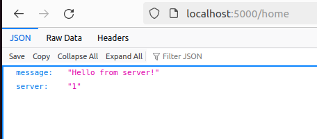

# Customizable Load Balancer 
# Introduction
This project aims to implement a highly customizable load balancer system that efficiently distributes incoming requests among multiple server instances. The load balancer utilizes consistent hashing algorithms to ensure even distribution of load and high availability of services.

## Overview
In distributed systems, load balancers play a crucial role in managing and optimizing resource utilization by distributing incoming requests across multiple server instances. This project focuses on implementing a load balancer system that can be easily customized and deployed in various distributed application scenarios.

## Features
- Dynamic Scalability: The load balancer system supports dynamic scaling of server instances to handle varying levels of incoming traffic.
- Consistent Hashing: Utilizes consistent hashing algorithms to evenly distribute requests among server instances while minimizing request rerouting in case of server failures.
- Fault Tolerance: Ensures high availability of services by automatically spawning new server instances in case of server failures.
- Easy Deployment: Docker-based deployment allows for easy setup and management of the entire system in a containerized environment.
  
## Dependencies
- Ubuntu 20.04 LTS or above
- Docker: Version 20.10.23 or above
- Docker-compose: Version 1.29.2 or above
- Python: Version 3.7 or above (for server implementation)
- Flask: Version 2.0 or above (for server implementation)
- Werkzeug 2.0.2
- aiohttp (for testing) 

## Installations
- `sudo apt-get update `
- `sudo apt-get install -y python3 python3-pip `
- `pip3 install Flask==2.0 Werkzeug==2.0.2 aiohttp `
- `sudo apt-get remove docker docker-engine docker.io containerd runc`
- `sudo apt-get install -y apt-transport-https ca-certificates curl gnupg lsb-release `
- `curl -fsSL https://get.docker.com -o get-docker.sh `
- `sudo systemctl enable docker`
- `sudo systemctl start docker`
- `sudo apt-get install -y docker-compose`
  
## Tasks
### Task 1: Server
This Flask application defines a simple web server with two endpoints. The /home endpoint responds to GET requests with a JSON message that includes a server identifier, which is fetched from an environment variable SERVER_ID. If the variable is not set, it defaults to 'Unknown'. The /heartbeat endpoint provides a health check by responding with a 200 OK status and an empty body. The application runs on host 0.0.0.0 and port 5000.

#### Testing Procedure:

- Create the Docker Image : `docker build -t simple-server .`

  
  
- Run the Docker  ` docker run -p 5000:5000 --name simple-server-instance -e SERVER_ID="1" simple-server`

- Test the End Points are working: `http://localhost:5000/home` in the browser.

### Flow of commands in Docker without CLI

- BUILD THE DOCKER IMAGE  `docker build -t simple-server .`

- TO VIEW THE IMAGES  - `docker images`

- RUN THE DOCKER CONTAINER  -  `docker run -p 5000:5000 --name simple-server-instance -e SERVER_ID="1" simple-server`

- CONFIRM ITS RUNNING - `docker ps`

- TEST THE END POINT - `http://localhost:5000/home` on the browser.

### Task 2: Consistent Hashing
The ConsistentHashing class implements a consistent hashing mechanism to distribute requests across multiple virtual server instances. The constructor initializes the class with the number of servers (N), number of slots (slots), and number of virtual nodes per server (K). The init_server_map method populates the server_map with virtual servers mapped to slots using a simple hash function. The get_server method determines the appropriate server for a given request by hashing the request ID and finding the corresponding slot in the server map, ensuring efficient and balanced request distribution.

#### Testing Procedure:

- Create 3 docker containers(server) by using this: `docker-compose up --scale server=3`

  

- Confirm that through the endpoint. `http://172.27.0.5:5000/rep`
  

-Confirm in the Docker App

#### Flow of commands

- BUILD UP 3 CONTAINERS FOR THE SERVER  `docker-compose up --scale server=3`

- CONFIRM ITS RUNNING - `docker-compose ps`

- TESTING ON BROWSER: `http://172.27.0.5:5000/rep`

  
### Task 3: Load Balancer
This Flask-based load balancer uses consistent hashing to distribute incoming requests across multiple server instances. It includes endpoints to view current replicas (/rep), add new servers (/add), remove servers (/rm), and route requests to the appropriate server (/). The consistent hashing ensures efficient and balanced distribution of the load among server instances.

#### Testing Procedure:

- Send HTTP requests to load balancer endpoints (/rep, /add, /rm, etc.):  

For /add, the command add 2 more servers, 4 and 5: `curl -X POST -H "Content-Type: application/json" -d '{"n": 2, "hostnames": ["S5", "S4"]}' http://172.27.0.5:5000/add`

 - To remove server 5 use ` curl -X DELETE -H "Content-Type: application/json" -d '{"n": 2, "hostnames": ["S5"]}' http://172.27.0.5:5000/rm`

  
### Task 4: Analysis
Task 4 involves testing and analyzing the performance of the load balancer implementation in various scenarios. We conduct experiments to evaluate load distribution among server containers and the system's ability to recover from server failures promptly.

#### Testing Procedure:
- First build up the docker containers again ` docker-compose build`

##### A-1: Launch 10,000 Asynchronous Requests on 3 Server Containers
- Run the test_script1.py

##### A-2: Launch 10,000 Asynchronous Requests on 6 Server Containers
- Run the test_script2.py after increasing the number of servers to 6

##### A-3 Test all endpoints of the load balancer 
- Stop the server first using `docker stop <SERVER_ID>`. Any server. Example: `docker stop Server 1`

- Run the test_script2.py again.

- The requests which were on server 1 were redestributed to the rest of the servers but it took roughly 5 minutes to adjust.

##### A-4: Modify Hash Functions

After modifying the hash functions used in our load balancer, we observed significant changes in how requests were distributed among server instances. The adjustments led to a noticeable shift in load balancing effectiveness, with some servers handling more requests than previously, while others received fewer. This variability directly impacted the overall efficiency of our load balancer in evenly distributing the workload across all servers. The quality of the new hash functions played a crucial role here: well-designed functions helped maintain stable performance even when servers were added or removed, whereas less effective functions struggled to balance the load consistently. These observations underscore the importance of choosing and refining hash functions carefully to optimize load balancing efficiency and maintain system stability under varying operational conditions.  

### Deployment Instruction
To get started with the Customizable Load Balancer project, follow these steps:
- Clone the project repository to your local Ubuntu machine.
- Install the required dependencies listed above.
- Follow the instructions provided in the individual task directories to implement and test each component.
- Refer to the README files in each task directory for detailed setup and testing instructions.
  
### Contribution
Contributions to the Customizable Load Balancer project are welcome! Feel free to fork the repository, make improvements, and submit pull requests. Please ensure that your code follows the project's coding guidelines and standards.

### Acknowledgments
Special thanks to the course instructors for providing the assignment specifications and guidance.
References to relevant research papers and documentation sources are provided in the project documentation.

